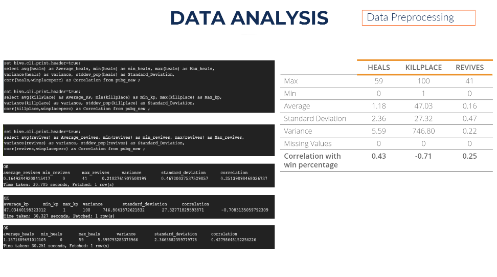
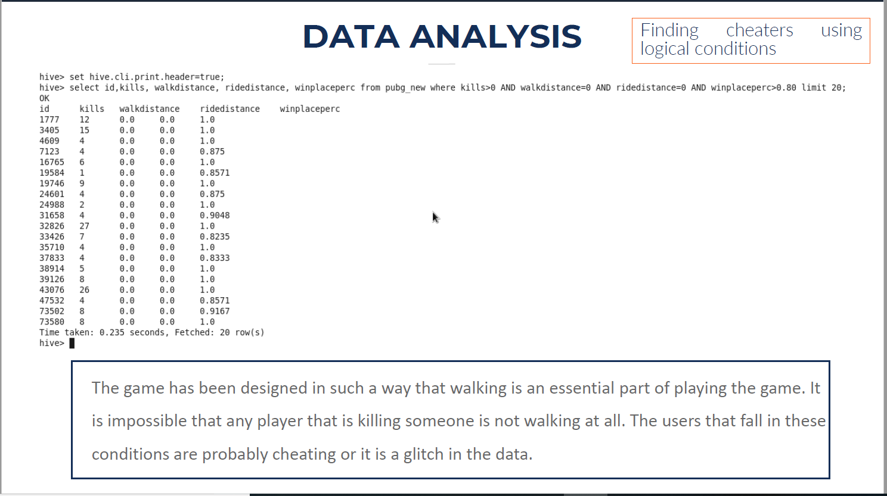
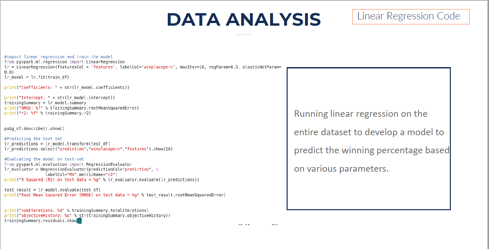

# Player Unknown's Battle Grounds (PUBG) Game Data Analysis   
> An analysis of Player Unknown's Battle Grounds (PUBG) Game Data using Hive, Impala and Spark. Presentation for the report can be found in [project presentation](https://github.com/Manishms18/Analysis-of-PUBG-Game-Data/blob/master/Big%20Data%20Project%20.pdf).         
     
## Table of contents
* [General info](#general-info)
* [Screenshots](#screenshots)
* [Technologies and Tools](#technologies-and-tools)
* [Setup](#setup)
* [Code Examples](#code-examples)
* [Features](#features)
* [Contact](#contact)

## General info

The goal of the study was to learn data analysis using various big data tools. I am a great fan of PUBG mobile game and the game developer had recently released the dataset on Kaggle. So I decided to take it up for the project, that way I also have an analytics edge when playing the game. 


## Screenshots





## Technologies and Tools
* Hive
* Spark 
* Impala

## Setup
The data for the analysis has been sourced from [Kaggle](https://www.kaggle.com/c/pubg-finish-placement-prediction). 
All the codes used in the analysis can be accessed [here](https://github.com/Manishms18/Analysis-of-PUBG-Game-Data/tree/master/code) and can be used to reproduce the results. 
A detailed explanation of the various operations and the interpretations of the outputs can be found in the [project report](https://github.com/Manishms18/Analysis-of-PUBG-Game-Data/blob/master/Big%20Data%20Project%20.pdf).

## Code Examples

````
#Correlation in Hive
set hive.cli.print.header=true;
select corr(weaponsacquired,winplaceperc) from pubg_new where match_type1='solo';
select corr(weaponsacquired,winplaceperc) from pubg_new where match_type1='Duo';
select corr(weaponsacquired,winplaceperc) from pubg_new where match_type1='Squad'
````

````
#Linear Regression in Pyspark
from pyspark import SparkContext, SparkConf
from pyspark.sql import SparkSession, HiveContext
hive_context=HiveContext(sc)
pubg=hive_context.table("pubg_new")

pubg=pubg.select('boosts', 'damagedealt', 'dbnos', 'headshotkills', 'heals', 'killplace', 'killpoints', 'kills', 'killstreaks', 'longestkill', 'maxplace', 'numgroups', 'revives', 'ridedistance', 'roadkills', 'swimdistance', 'teamkills', 'vehicledestroys', 'walkdistance', 'weaponsacquired', 'winpoints', 'winplaceperc')
pubg.show(10) 
pubg.printSchema()
pubg.cache()

from pyspark.ml.feature import VectorAssembler
vectorAssembler = VectorAssembler(inputCols = ['boosts', 'damagedealt', 'dbnos', 'headshotkills', 'heals', 'killplace', 'killpoints', 'kills', 'killstreaks', 'longestkill', 'maxplace', 'numgroups', 'revives', 'ridedistance', 'roadkills', 'swimdistance', 'teamkills', 'vehicledestroys', 'walkdistance', 'weaponsacquired', 'winpoints', 'winplaceperc'], outputCol = 'features')
pubg_df=vectorAssembler.transform(pubg)
pubg_df = pubg_df.select(['features', 'winplaceperc'])
pubg_df.show(3)

splits = pubg_df.randomSplit([0.7, 0.3])
train_df = splits[0]
test_df = splits[1]

from pyspark.ml.regression import LinearRegression
lr = LinearRegression(featuresCol = 'features', labelCol='winplaceperc', maxIter=10, regParam=0.3, elasticNetParam=0.8)
lr_model = lr.fit(train_df)

print("Coefficients: " + str(lr_model.coefficients))
print("Intercept: " + str(lr_model.intercept))
trainingSummary = lr_model.summary
print("RMSE: %f" % trainingSummary.rootMeanSquaredError)
print("r2: %f" % trainingSummary.r2)

pubg_df.describe().show()
lr_predictions = lr_model.transform(test_df)
lr_predictions.select("prediction","winplaceperc","features").show(10)

from pyspark.ml.evaluation import RegressionEvaluator
lr_evaluator = RegressionEvaluator(predictionCol="prediction", \
                 labelCol="winplaceperc",metricName="r2")
print("R Squared (R2) on test data = %g" % lr_evaluator.evaluate(lr_predictions))

test_result = lr_model.evaluate(test_df)
print("Root Mean Squared Error (RMSE) on test data = %g" % test_result.rootMeanSquaredError)
print("numIterations: %d" % trainingSummary.totalIterations)
print("objectiveHistory: %s" % str(trainingSummary.objectiveHistory))
trainingSummary.residuals.show()

predictions = lr_model.transform(test_df)
predictions.select("prediction","winplaceperc","features").show()
````

## Features  
The analysis is focussed on answering questions stated below:
  * Does killing more people increases the chance of winning the game?
  * Can we predict the finishing position of a player in the game?
  * How do we catch the cheaters in the game?
  
The answers to the questions can be found in the [report](https://github.com/Manishms18/Analysis-of-PUBG-Game-Data/blob/master/Big%20Data%20Project%20.pdf). 

## Contact
If you loved what you read here and feel like we can collaborate to produce some exciting stuff, or if you
just want to shoot a question, please feel free to connect with me on 
<a href="mailto:manishshukla.ms18@gmail.com">email</a> or 
<a href="https://www.linkedin.com/in/manishshukla-ms/" target="_blank">LinkedIn</a>
